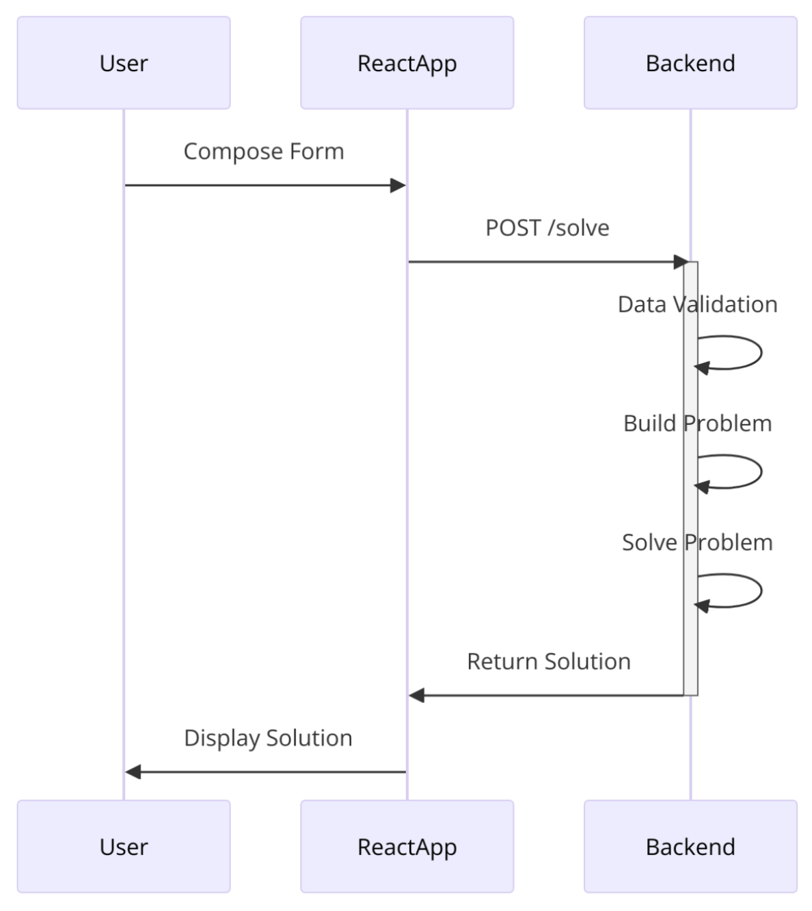

# 1. Movers SAT problem<!-- omit in toc -->

This project allows to compute an optimal forniture moving schedule that allows a team of movers to complete their job in the most efficient way possible. This project provides a complete frontend and backend system that is able to receive a problem instance from the user, solve it using [z3-solver](https://github.com/Z3Prover/z3), and return the solution to the user. The frontend is built using [React](https://react.dev/) and [Chakra UI](https://v2.chakra-ui.com/), while the backend is implemented using [FastAPI](https://fastapi.tiangolo.com/).

To have a complete overview of how the various parts of the system interact with each other, please refer to the [System Design](#system-design) section.

## Table of Contents<!-- omit in toc -->

- [1.1. Problem Description](#11-problem-description)
- [1.2. SAT mathematical model](#12-sat-mathematical-model)
	- [1.2.1. Input Parameters](#121-input-parameters)
	- [1.2.2. Sets / Domains](#122-sets--domains)
	- [1.2.3. Variables](#123-variables)
		- [A. Variables describing the state of the system](#a-variables-describing-the-state-of-the-system)
		- [B. Variables describing the actions of the movers](#b-variables-describing-the-actions-of-the-movers)
	- [1.2.4. Constraints](#124-constraints)
		- [A. Action Definition](#a-action-definition)
		- [B. Initial and Final Constraints](#b-initial-and-final-constraints)
		- [C. Other Constraints](#c-other-constraints)
- [1.3. System Design](#13-system-design)
	- [1.3.1. Frontend - User Interface](#131-frontend---user-interface)
	- [1.3.2. Backend - APIs and Solver](#132-backend---apis-and-solver)
- [1.4. Evaluation and final considerations](#14-evaluation-and-final-considerations)

## 1.1. Problem Description

In the *movers satisfiability problem*, a moving company is tasked with
relocating all furniture from a building with multiple floors. The
objective is to move all furniture to the ground floor within a given
time frame (maximum number of time steps). For this task, the company
has a team of movers of size $m$, and each mover is identified with a
unique name, and can move up or down one floor at a time.

The building has $n$ floors, each identified by a unique integer number.
The building contains a set of furniture $F = {f1,f2,...,fn}$ to be
moved. Each piece of furniture is located within the floors of the
building, and there could be more than one piece of furniture on the
same floor. The movers are initially located on the ground floor of the
building, and they must move all furniture to the ground floor within a
given time frame. By the end of the time frame, all movers and all
furniture must be located on the ground floor in order to solve the
problem.

When a mover is on the same floor as a piece of furniture, and decides
to carry it, the mover and the furniture in question are moved together
to the floor below.

## 1.2. SAT mathematical model

### 1.2.1. Input Parameters

1. $m \in \mathbb{N}^+$: number of movers

2. $n \in \mathbb{N}^+$: number of floors

3. $t_{max} \in \mathbb{N}^+$: maximum number of steps to solve the
    problem

### 1.2.2. Sets / Domains

- $M = \{m_1, m_2, ..., m_m\}$: set of movers

- $L = \{l_1, l_2, ..., l_n\}$: set of floors (\"levels\") in the
    building

- $F = \{f_1, f_2, ..., f_k\}$: set of forniture items

- $T = \{t_1, t_2, ..., t_{max}\}$: set of timestamps from 1 to
    $t_{max}$

### 1.2.3. Variables

#### A. Variables describing the state of the system

- $atFloor(m, l, t) \in \{0, 1\}$, *True* if mover $m$ is at floor $l$
    at time $t$

- $atFloorForniture(f, l, t) \in \{0, 1\}$, *True* if forniture $f$ is
    at floor $l$ at time $t$

#### B. Variables describing the actions of the movers

- $ascend(m, t) \in \{0, 1\}$, *True* if mover $m$ is ascending at
    time $t$

- $descend(m, t) \in \{0, 1\}$, *True* if mover $m$ is descending at
    time $t$

- $carry(m, f,  t) \in \{0, 1\}$, *True* if mover $m$ is carrying
    forniture $f$ at time $t$

### 1.2.4. Constraints

#### A. Action Definition

This section describes how the actions of the movers alter the state of
the system.

1. $ascend(m, t)$: a mover can move up one floor at a time (except when at the last floor):

    $$l < n -1 \land atFloor(m, l, t) \land ascend(m, t) \implies atFloor(m, l+1, t+1)$$
    $\forall$ mover $m \in M$, floor $l \in L$, time $t \in T$

2. $descend(m, t)$: a mover can move down one floor at a time (except
    when at the ground floor):

    $$l > 0 \land atFloor(m, l, t) \land descend(m, t) \implies atFloor(m, l-1, t+1)$$
    $\forall$ mover $m \in M$, floor $l \in L$, time $t \in T$

3. $carry(m, f, t)$: a mover can carry a piece of forniture if it is at
    the same floor as the mover. At the next time step, the mover and
    the forniture will be at the floor below (except when at the ground
    floor):

    $l > 0 \land atFloor(m, l, t) \land atFloorForniture(f, l, t) \land carry(m, f, t) \implies atFloor(m, l-1, t+1) \land atFloorForniture(f, l-1, t+1)$

    $\forall \ \text{mover } m \in M, \text{forniture } f \in F, \text{floor } l \in L, \text{time } t \in T$


#### B. Initial and Final Constraints

1. Initial constraint: movers start at the ground floor

    $$atFloor(m_i, 0, 0)$$

    $\forall$ mover $m \in M$

2. Final constraint: movers end at the ground floor

    $$atFloor(m, 0, t_{max}) \land atFloorForniture(f, 0, t_{max})$$

    $\forall$ mover $m \in M$, forniture $f \in F$

#### C. Other Constraints

1. Each mover is exactly at one floor at a time

    - Each mover is at least at one floor
        $$\bigvee_{m \in M, l \in L, t\in T} atFloor(m, l, t)$$

    - A mover cannot be at more than one floor
        $$atFloor(m, l_1, t) \implies \lnot atFloor(m, l_2, t)$$

        $\forall$ mover $m \in M$, floors $l_1 \neq l_2 \in L$, time
        $t \in T$

2. Each forniture is exactly at one floor at a time

    - Each forniture is at least at one floor
        $$\bigvee_{f \in F, l \in L, t\in T} atFloorForniture(f, l, t)$$

    - A forniture cannot be at more than one floor
        $$atFloorForniture(f, l_1, t) \implies \lnot atFloorForniture(f, l_2, t)$$

        $\forall$ forniture $f \in F$, floors $l_1 \neq l_2 \in L$, time
        $t \in T$

3. If a mover is not ascending, descending, or carrying it stays at the
    same floor

    $$atFloor(m,l,t) \land \lnot ascend(m, t) \land \lnot descend(m, t) \land \bigwedge_{f \in F} \lnot carry(m, f, t) \implies atFloor(m,l, t+1)$$

    $\forall$ mover $m \in M$, floor $l \in L$, time $t \in T$

4. If a forniture is not being carried, it stays at the same floor

    $$atFloorForniture(f, l, t) \land \bigwedge_{m \in M} \lnot carry(m, f, t) \implies atFloorForniture(f, l, t + 1)$$

    $\forall$ forniture $f \in F$, floor $l \in L$, time $t \in T$

5. Each mover can do only one action at a time

    - $ascend(m, t) \implies \lnot descend(m, t)$

    - $ascend(m, t) \implies \lnot carry(m, f, t)$

    - $descend(m, t) \implies \lnot ascend(m, t)$

    - $descend(m, t) \implies \lnot carry(m, f, t)$

    - $carry(m, f, t) \implies \lnot ascend(m, t)$

    - $carry(m, f, t) \implies \lnot descend(m, t)$

    $\forall$ mover $m \in M$, floor $l \in L$, forniture $f \in F$,
    time $t \in T$

6. Each mover can carry at most one piece of forniture

    $$carry(m, f_1, t) \implies \lnot carry(m, f_2, t)$$

    $\forall$ mover $m\in M$, forniture $f_1 \neq f_2 \in F$, time
    $t \in T$

7. A piece of forniture can be carried by only one mover

    $$carry(m_1, f, t) \implies \lnot carry(m_2, f, t)$$

    $\forall$ mover $m_1 \neq m_2 \in M$, forniture $f\in F$, time
    $t \in T$

8. Movers cannot ascend if they are at the top floor

    $$atFloor(m, n-1, t) \implies \lnot ascend(m, t)$$

    $\forall$ mover $m \in M$, time $t \in T$

9. Movers cannot descend if they are at the ground floor

    $$atFloor(m, 0, t) \implies \lnot descend(m, t)$$

    $\forall$ mover $m \in M$, time $t \in T$

10. A mover has to be on the same floor as an item in order to carry it

    $$atFloor(m, l_1,t) \land atFloorForniture(f, l_2, t) \implies \lnot carry(m, f, t)$$

    $\forall$ mover $m \in M$, floors $l_1 \neq l_2 \in L$ , forniture
    $f \in F$, time $t \in T$

11. A mover cannot carry an item which is at the ground floor

    $$atFloorForniture(f, 0, t) \implies \lnot carry(m, f, t)$$

    $\forall$ mover $m \in M$, forniture $f \in F$, time $t \in T$

## 1.3. System Design

The system has been divided into a frontend and a backend. The frontend
is responsible for receiving the problem instance from the user and
sending it to the backend for processing. The backend will receive the
problem data from a specialized API and will solve the problem using the
z3-solver. The solution will be sent back to the frontend as a response.

In the following sections, the frontend and backend will be described in
more detail.

### 1.3.1. Frontend - User Interface

The frontend of our system is built using Chakra UI, a simple, modular,
and accessible component library that provides the building blocks
needed to build React applications. Chakra UI ensures a consistent look
and feel across the application and enhances the development experience
with its extensive set of customizable components.

To facilitate interaction with the backend API, we have implemented a
custom library. This library simplifies API calls and manages the
communication between the frontend and backend, ensuring a seamless and
efficient data exchange.

The user initiates the process by composing a form in the React-app.
This form contains information about the problem setup, such as the
number of movers, floors, maximum steps, and furniture details. Once the
form is completed, the React-app sends an HTTP POST request to the
backend solver service at the `/solve` endpoint. This request includes
the data provided by the user. This form is used to validate user inputs
before sending data to the backend. It ensures that the data received by
the backend is correct and reduces the likelihood of errors, providing a
smoother user experience.


### 1.3.2. Backend - APIs and Solver

The backend, as previously mentioned, is responsible for receiving the
problem instance from the frontend and solving it using the z3-solver.
The backend exposes a single endpoint `/solve` which receives a JSON
object containing the problem instance and returns a JSON object with
the solution.

This `curl` command showcases an example of how to interact with the `/solve` endpoint using the backend API:

```bash
    curl -X 'POST' \
        'http://localhost:8000/api/v1/solve?n_movers=3&n_floors=3&max_steps=10' \
        -H 'accept: application/json' \
        -H 'Content-Type: application/json' \
        -d '[
            {
            "name": "Table",
            "floor": 1
            },
            {
            "name": "Wardrobe",
            "floor": 2
            }
        ]'
```

The sequence diagram below illustrates the interaction between a
user, the React-app frontend via Custom API, and the backend solver
service in a Movers SAT problem-solving application.



Below is a step-by-step explanation of the process:

1. **Backend Solver Service**:

    - Upon receiving the request, the backend solver service is
        activated and begins processing the request.

    - **Data Validation**: The backend performs data validation to
        ensure that the input parameters (number of movers, floors,
        maximum steps, and furniture details) are valid and correctly
        formatted.

    - **Problem Building**: After successful validation, the backend
        constructs the problem by defining the necessary constraints and
        setup required to solve the Movers SAT problem.

    - **Problem Solving**: The backend then runs the solver to compute
        the solution to the problem. This involves calculating the
        optimal steps and actions needed to move the furniture as
        specified.

2. **Response to React-app**:

    - Once the problem is solved, the backend sends the solution back
        to the React-app. This response includes the computed steps and
        actions for the movers and furniture.

3. **Display Solution**:

    - The React-app receives the solution and displays it to the user.
        The user can now see the detailed steps and actions taken to
        solve the Movers SAT problem.

This diagram captures the entire workflow from user input to solution
display, highlighting the key interactions and processes involved in
solving the Movers SAT problem using the React-app and backend solver
service.

## 1.4. Evaluation and final considerations

First of all, we needed to thoroughly understand the problem at hand. To
achieve this, we organized a comprehensive discussion involving all team
members. This discussion aimed to elucidate the various aspects of the
problem, ensuring that everyone had a clear and vivid understanding of
the issue. We explored different perspectives, asked clarifying
questions, and shared relevant insights, all of which contributed to a
more profound and collective grasp of the problem's intricacies. Then we
divided into smaller groups so that we could work on frontend and
backend at the same time.

**General Problems:**

1. As none of us had prior experience with the z3-solver, we had to
    spend a considerable amount of time learning how to use it
    effectively.

2. We encountered some difficulty in identifying all the edge cases of
    the problem due to the lack of clarity in certain descriptions.

**Frontend Problems:**

1. Due to our initial unfamiliarity with the React library, we required
    a considerable amount of time to learn how to utilize it effectively
    to achieve the desired results.

2. Offering a user-friendly interface that is both intuitive and easy
    to use was a significant challenge. We had to ensure that the
    interface was easy to navigate and that users could input the
    necessary data without any confusion.

**Backend Problems:**

1. We initially thought that certain constraints were not necessary,
    but after further analysis, we realized that they were crucial for
    the problem's correct solution.

2. The backend API was challenging to implement as it required
    additional features such as data validation, error handling, and
    response formatting, features that we initially overlooked.
